# 一、注册测试号
点进去微信扫码[https://mp.weixin.qq.com/debug/cgi-bin/sandbox?t=sandbox/login](https://mp.weixin.qq.com/debug/cgi-bin/sandbox?t=sandbox/login)
记住下面的【APPID】和【appsecret】
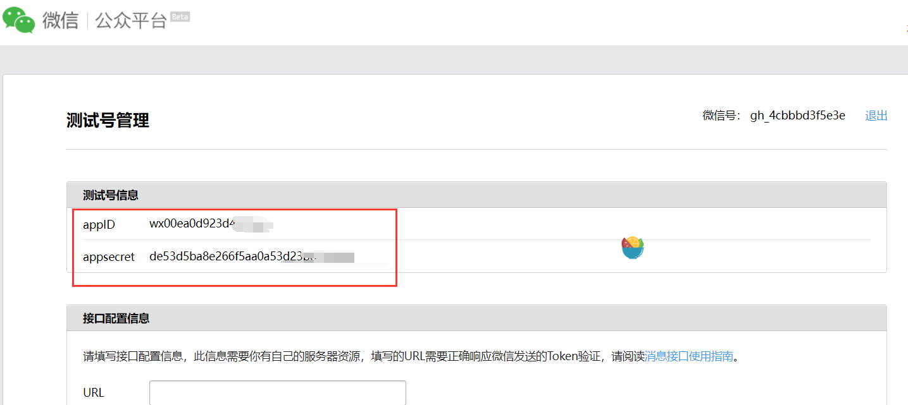

往下滑到【测试号二维码】，扫码获得【微信号】
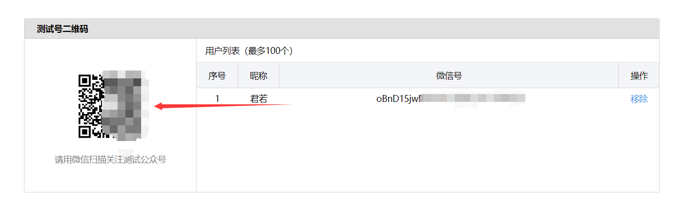

继续往下滑到【模块消息接口】  
新增测试模块   
这里给一个示例：	{{riqi.DATA}} {{beizhu.DATA}} 天气: {{tianqi.DATA}} 最低温度:{{low.DATA}}度 最高温度:{{high.DATA}}度 距离你的生日还有{{shengri.DATA}}天 {{caihongpi.DATA}} {{jinju.DATA}}
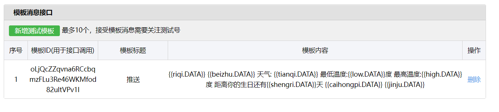

# 二、申请第三方接口配置秘钥
## 1、百度地图接口
点击进入百度地图控制台[https://lbsyun.baidu.com/apiconsole/center#/home](https://lbsyun.baidu.com/apiconsole/center#/home)  
注册账号，认证账号，完成后进入控制台中的应用管理创建应用
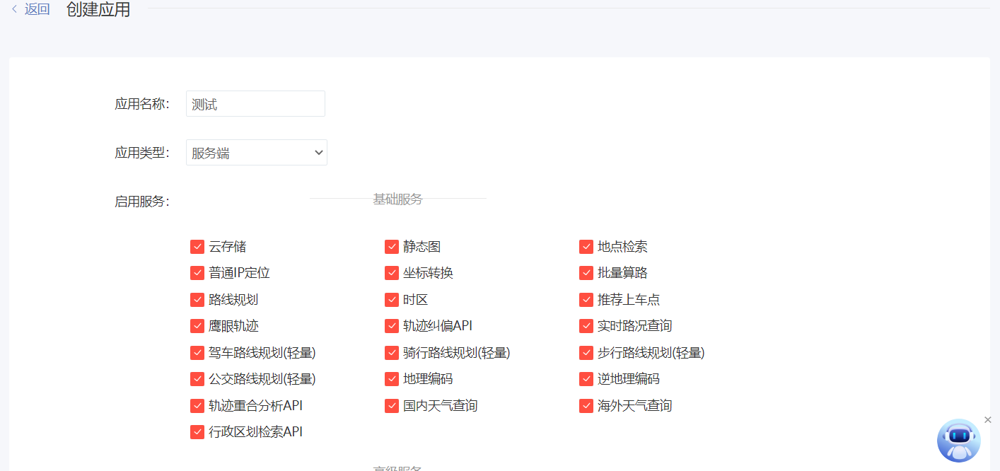  
注意ip白名单填写：0.0.0.0/0
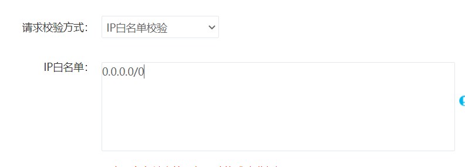
最后填写使用场景就百度随便填吧。
创建成功后记录该应用的【AK】。
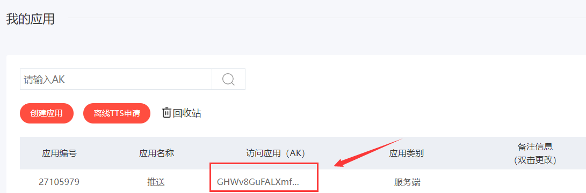

## 2、天行数据接口
点击进入天行数据控制台[https://www.tianapi.com/](https://www.tianapi.com/)  
注册账号，认证账号。
申请彩虹屁接口[https://www.tianapi.com/apiview/181](https://www.tianapi.com/apiview/181)  
申请英语一句话接口[https://www.tianapi.com/apiview/62](https://www.tianapi.com/apiview/62)  
返回天行数据控制台  
点击我的秘钥
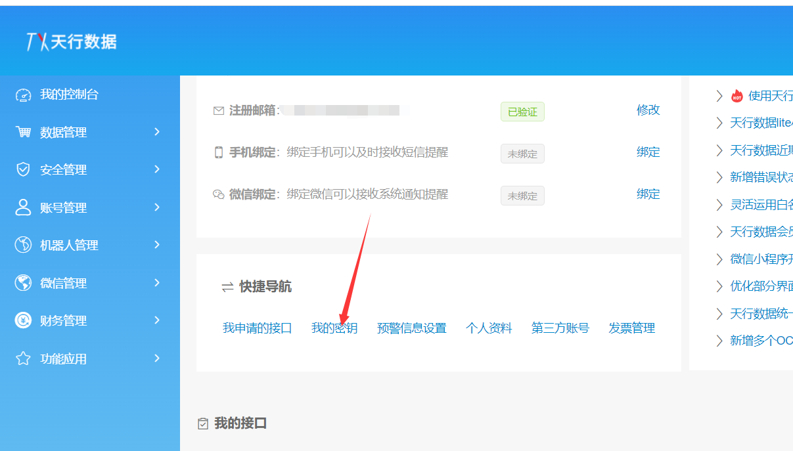
记录一下【APIKEY】

## 三、导入工程
下载本项目，使用idea打开。  
刷新maven，等待加载。  
进入WeatherUtils类  
修改19行和21行
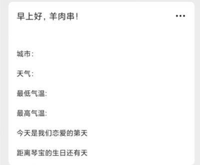

进入CaiHongPiUtils类    
为20行和50行key末尾加上自己的天行数据key
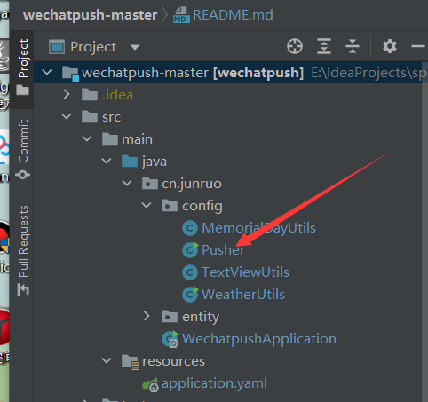

进入Pusher类  
修改20行和21行为公众号平台上面对应的值（见第一大步）
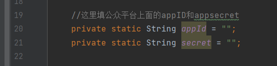  
34行和35行填写第一大步中的微信号和模板id
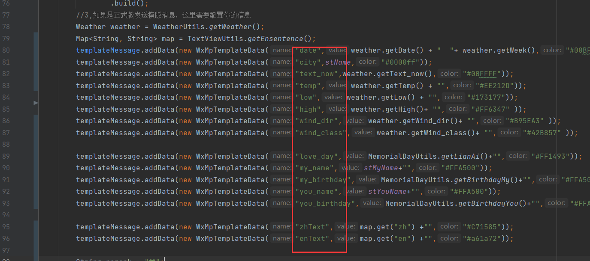
下图37行以后的红框里面的字符串对应着公众号测试模板中的变量，可以自行更改
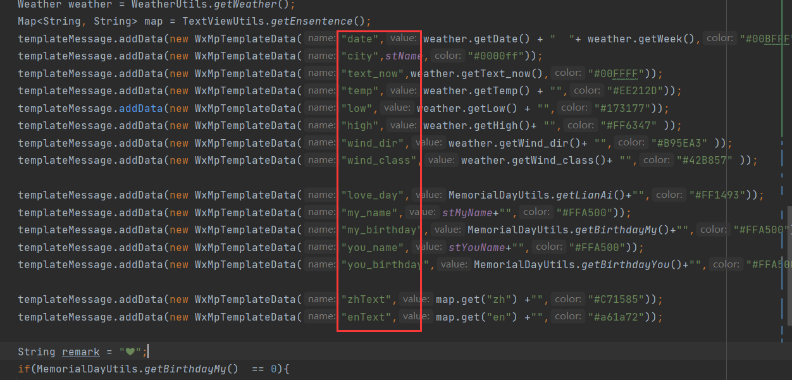

进入WechatpushApplication类  
点击绿色三角形按钮即可运行项目
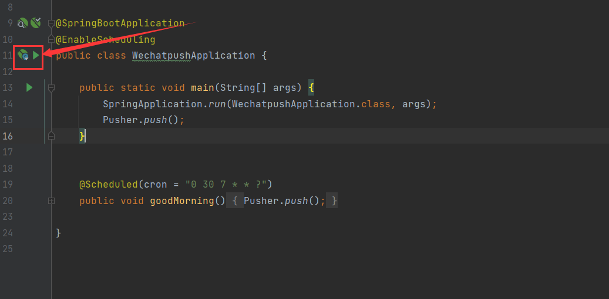
其中@Scheduled(cron = "0 30 7 * * ?")为定时任务。
