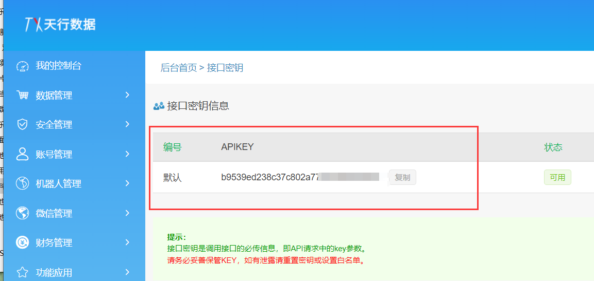

# 已同步至码云[https://gitee.com/junxiaoruo/Wechatpush](https://gitee.com/junxiaoruo/Wechatpush)

# 更新通知
配置已经集成至resources目录下的application.yaml文件中了，并有详细的说明。  
修复了自动推送。 
可以推送给多人，见配置文件。  
取消了彩虹屁api，使用英语一句话api进行中英文对接。  
QQ：1813774883  
QQ群：747234568

# 前置条件
windows用户需要提前安装jdk1.8并配置好环境变量：可以参考[https://blog.csdn.net/m0_62589051/article/details/125801467](https://blog.csdn.net/m0_62589051/article/details/125801467)  
windows用户需要提前下载intellij IDEA软件，最好下载专业版并破解，具体方法可以百度查看。  
  
给出本人方案：  
本人使用的为2021.2.1版本，下载地址[https://download.jetbrains.com/idea/ideaIU-2021.2.1.exe](https://download.jetbrains.com/idea/ideaIU-2021.2.1.exe)   
安装完成后下载破解文件（内置教程）[https://file.zmkj6.top/file/zm_app/img/1661307695_7799.rar](https://file.zmkj6.top/file/zm_app/img/1661307695_7799.rar)  
  

使用linux运行打包项目需要提前安装jdk，具体方法请百度。

# 正式开始
# 一、注册测试号
点进去微信扫码[https://mp.weixin.qq.com/debug/cgi-bin/sandbox?t=sandbox/login](https://mp.weixin.qq.com/debug/cgi-bin/sandbox?t=sandbox/login)
记住下面的【APPID】和【appsecret】

往下滑到【测试号二维码】，扫码获得【微信号】（现已支持多个微信号推送，将获取到的多个微信号填入到application.yaml配置文件中的openID即可，以英文逗号分割）  

继续往下滑到【模块消息接口】  
新增测试模块  

这里给一个示例：  
今天是：{{date.DATA}} {{week.DATA}}  
我在：{{city.DATA}}  
当前天气: {{text_now.DATA}}  
当前温度：{{temp.DATA}}  
最低温度：{{low.DATA}}度  
最高温度：{{high.DATA}}度  
风向：{{wind_dir.DATA}}  
风力：{{wind_class.DATA}}  
我们已相恋{{love_day.DATA}}天  
距离{{my_name.DATA}}生日还有{{my_birthday.DATA}}天  
距离{{you_name.DATA}}生日还有{{you_birthday.DATA}}天  
{{remark.DATA}}  
  
{{zhText.DATA}}  
{{enText.DATA}}  

# 二、申请第三方接口配置秘钥
## 1、百度地图接口
点击进入百度地图控制台[https://lbsyun.baidu.com/apiconsole/center#/home](https://lbsyun.baidu.com/apiconsole/center#/home)  
注册账号，认证账号，完成后进入控制台中的应用管理创建应用
  
注意ip白名单填写：0.0.0.0/0

最后填写使用场景就百度随便填吧。
创建成功后记录该应用的【AK】。

## 2、天行数据接口
点击进入天行数据控制台[https://www.tianapi.com/](https://www.tianapi.com/)  
注册账号，认证账号。  
申请英语一句话接口[https://www.tianapi.com/apiview/62](https://www.tianapi.com/apiview/62)  
返回天行数据控制台  
点击我的秘钥

记录一下【APIKEY】

# 三、导入工程
下载本项目  

解压  
  
打开idea，点击open，选择解压后的文件（！！注意选择的是前面带小黑框的文件夹！！）  

等待加载。  
加载完成后左边目录打开src/main/resources。所有配置在此设置。  
  
填入上面第一大步、第二大步获取到的值。

进入WechatpushApplication类  
点击绿色三角形按钮即可运行项目

测试完成（idea不关闭项目一直运行。可以打包部署节省内存资源）

# 四、部署（可选）
打包

完成后左边目录中找到target文件夹，里面找到打包好的jar文件，可以将此文件上传到服务器中。

windows使用：java -jar wechatpush-0.0.1-SNAPSHOT.jar

  
linux系统使用：nohup java -jar wechatpush-0.0.1-SNAPSHOT.jar >temp.txt 2>&1 &
  
教程完毕！  
QQ：1813774883  
QQ群：747234568

# 常见问题  
## 1，在哪修改推送内容呢？  
推送内容需要网页微信公众号平台和Pusher类中两个方面进行更改。

  
模板内容中{{}}的“.DATA”前的字符串对应着Pusher类中下方红框内容  

  
## 2，推送内容为空或报错  

模板内容中{{}}的“.DATA”前的字符串与Pusher类中下方红框内容不对应匹配
  
  
例如：

## 3，天气工具类报空指针NULL错误

请在配置文件中输入正确的地区行政代码：  
【参见】--->>[https://mapopen-website-wiki.bj.bcebos.com/cityList/weather_district_id.csv](https://mapopen-website-wiki.bj.bcebos.com/cityList/weather_district_id.csv)

